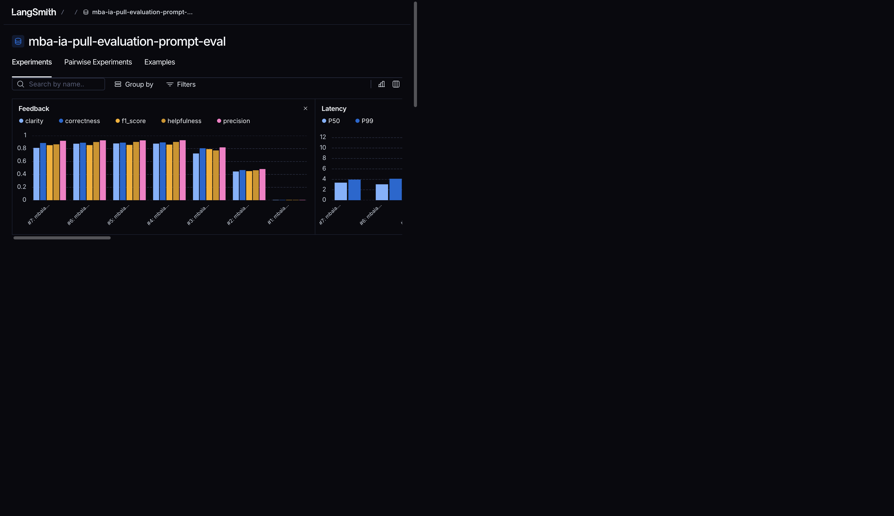
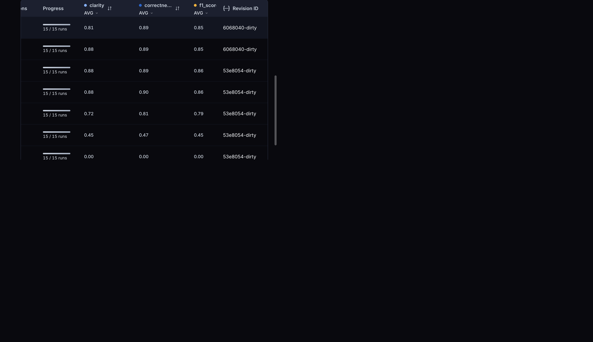
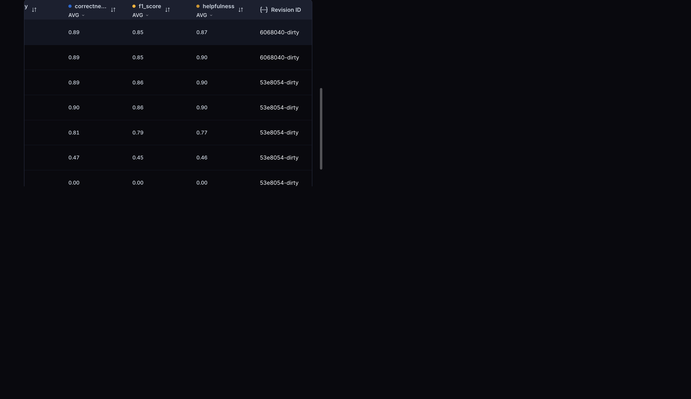

# Pull, Otimização e Avaliação de Prompts com LangChain e LangSmith

Software que faz pull de um prompt de baixa qualidade do LangSmith Prompt Hub,
refatora e otimiza esse prompt com técnicas avançadas de Prompt Engineering,
faz push da versão otimizada de volta ao LangSmith e avalia a qualidade com 5
métricas customizadas (Helpfulness, Correctness, F1-Score, Clarity e
Precision), atingindo pontuação >= 0.8 em todas.

## Técnicas Aplicadas (Fase 2)

O prompt `prompts/bug_to_user_story_v1.yml` era genérico: não define persona,
não explica o formato esperado de saída, não traz exemplos e mistura o dado de
entrada (`{bug_report}`) dentro do `system_prompt`. Isso deixa o modelo livre
para gerar qualquer formato de user story, sem critérios de aceitação
padronizados e sem tratamento para relatos ambíguos — por isso as métricas de
Correctness, Clarity e Precision ficavam abaixo de 0.5.

O `prompts/bug_to_user_story_v2.yml` refatora o prompt aplicando as seguintes
técnicas:

1. **Few-shot Learning (obrigatório)**
   - **Por quê**: é a técnica com maior impacto na aderência ao formato
     Given-When-Then usado no dataset de referência (`datasets/bug_to_user_story.jsonl`).
     Mostrar exemplos reduz drasticamente a variação de estrutura e vocabulário
     entre execuções.
   - **Como foi aplicada**: o `system_prompt` inclui 4 exemplos completos de
     entrada/saída — dois bugs "normais" (UX e funcional), um relato ambíguo
     (`"Sistema está lento."`) e um texto que não é um bug — cada um mostrando
     exatamente o formato de User Story + Critérios de Aceitação esperado.

2. **Chain of Thought (CoT)**
   - **Por quê**: transformar um relato de bug em user story exige raciocínio
     em múltiplas etapas (identificar persona, ação, valor de negócio e
     cenários de teste). Pedir para o modelo pensar passo a passo antes de
     responder melhora a Correctness e o F1-Score.
   - **Como foi aplicada**: a seção `# PROCESSO DE RACIOCÍNIO` instrui o
     modelo a resolver 5 passos internamente (persona → ação → valor →
     cenários de aceite → contexto técnico) antes de escrever a resposta.
     O raciocínio é mantido interno (não exposto na resposta final) para não
     poluir a saída avaliada nem prejudicar a métrica de Clarity.

3. **Skeleton of Thought**
   - **Por quê**: define de antemão o "esqueleto" da resposta (User Story →
     Critérios de Aceitação → Contexto Técnico opcional), garantindo saídas
     consistentes entre execuções e compatíveis com o formato do dataset de
     referência — o que melhora diretamente Clarity e F1-Score.
   - **Como foi aplicada**: a seção `# ESTRUTURA DA RESPOSTA` fixa as 3 partes
     da resposta, na ordem exata, incluindo quando a seção de Contexto Técnico
     deve ou não aparecer.

4. **Role Prompting (técnica adicional)**
   - **Por quê**: dar uma persona específica ("Product Manager Sênior
     especializado em metodologias ágeis") ancora o tom profissional e
     empático esperado, sem precisar de instruções soltas sobre "como
     escrever".
   - **Como foi aplicada**: a seção `# PERSONA`, no início do `system_prompt`.

Além das técnicas acima, o v2 corrige dois problemas estruturais do v1:

- **System vs User Prompt**: no v1, o relato de bug (`{bug_report}`) estava
  embutido dentro do `system_prompt`. No v2, o `system_prompt` contém apenas
  instruções fixas (persona, regras, raciocínio, esqueleto e exemplos) e o
  `user_prompt` contém somente `{bug_report}`, isolando dado de entrada de
  instrução — uso correto da separação system/user.
- **Edge cases**: regras explícitas para relatos ambíguos/incompletos
  (assumir e sinalizar com "(assumido)"), relatos com múltiplos bugs (focar no
  mais severo e citar os demais em "Observação:") e entradas que não são
  relatos de bug (resposta padrão pedindo mais detalhes, sem inventar uma user
  story).

## Resultados Finais

### Link público do dataset de avaliação (com experimentos)

O dataset `mba-ia-pull-evaluation-prompt-eval` (15 exemplos) e todos os
experimentos rodados contra ele estão públicos no LangSmith:

**https://smith.langchain.com/public/9317c0df-78b4-4ce9-a8c8-1dc9b70123d5/d**

No link estão visíveis:

- O dataset de avaliação com os 15 exemplos (aba **Examples**)
- Todas as execuções (experimentos) do prompt `mbaiafullcyclebrit0/bug_to_user_story_v2`,
  com as 5 notas gravadas como feedback (aba **Experiments**)
- O tracing detalhado de cada um dos 15 exemplos em cada experimento
  (clique em um experimento → clique em qualquer linha)

### Notas finais (todas >= 0.8)

Melhor experimento aprovado (`bug_to_user_story_v2-794447d4`, 15/15 runs):

| Métrica      | Nota | Mínimo | Status |
|--------------|------|--------|--------|
| Helpfulness  | 0.90 | 0.8    | ✓      |
| Correctness  | 0.90 | 0.8    | ✓      |
| F1-Score     | 0.86 | 0.8    | ✓      |
| Clarity      | 0.88 | 0.8    | ✓      |
| Precision    | 0.93 | 0.8    | ✓      |

```
✅ STATUS: APROVADO - Todas as métricas >= 0.8
📊 MÉDIA GERAL: 0.8890
```

### Screenshots

Visão geral do dataset público com o gráfico de feedback dos experimentos
(as 4 últimas iterações acima de 0.8 em todas as métricas):



Tabela de experimentos com 15/15 runs e as notas médias de Clarity,
Correctness e F1-Score:



Colunas de Correctness, F1-Score e Helpfulness dos mesmos experimentos:



### Histórico de iterações

| # | Experimento | Resultado | O que foi feito |
|---|-------------|-----------|-----------------|
| 1 | `...-098e51a1` | 0.00 em tudo (100% erro) | Provider configurado como `google` com modelo OpenAI — mismatch no `.env` fazia todas as chamadas falharem silenciosamente |
| 2 | `...-47c008af` | ~0.45–0.48 (47% erro) | Corrigido o provider, mas rate limit de TPM da OpenAI zerava métricas de vários exemplos no meio da execução |
| 3 | `...-80835f47` | 0.72–0.82 (Clarity < 0.8) | Adicionado retry com backoff (`invoke_with_retry` em `src/utils.py`) para tratar os erros 429 |
| 4–7 | `...-224cf3ca`, `...-794447d4`, `...-13af0bed`, `...-777139b9` | **Todas >= 0.8** ✅ | Com a infraestrutura estável, o prompt v2 aprovou de forma consistente em 4 execuções seguidas |

Aprendizado importante: notas 0.00 uniformes em todas as métricas de um
exemplo indicam **falha na chamada ao LLM** (erro de configuração ou rate
limit), não prompt ruim — notas de prompt de baixa qualidade são parciais e
mistas, como as do v1 (~0.45–0.52).

### Comparação v1 vs v2: o que mudou e por quê

| Aspecto | v1 (original) | v2 (otimizado) | Por quê |
|---------|---------------|----------------|---------|
| Persona | Nenhuma | Product Manager Sênior especializado em metodologias ágeis (Role Prompting) | Ancora tom e vocabulário profissional sem instruções soltas |
| Formato de saída | Livre (não especificado) | Esqueleto fixo: User Story → Critérios de Aceitação (Given/When/Then) → Contexto Técnico (Skeleton of Thought) | Saídas consistentes e alinhadas ao dataset de referência → melhora Clarity e F1 |
| Exemplos | Nenhum | 4 exemplos completos de entrada/saída, incluindo casos ambíguos e não-bug (Few-shot) | Maior impacto na aderência ao formato Given-When-Then |
| Raciocínio | Nenhum | 5 passos internos: persona → ação → valor → cenários → contexto técnico (CoT) | Melhora Correctness e F1 em tarefa de raciocínio multi-etapas |
| System vs User | `{bug_report}` embutido no system prompt | System só com instruções fixas; user prompt só com `{bug_report}` | Separação correta entre instrução e dado de entrada |
| Edge cases | Não tratados | Regras para relatos ambíguos ("(assumido)"), múltiplos bugs ("Observação:") e entradas que não são bug | Evita alucinação de user stories a partir de entradas inválidas |
| Métricas | ~0.45–0.52 (reprovado) | 0.86–0.93 (aprovado) | — |

## Como Executar

### Pré-requisitos

- Python 3.10+
- Conta no [LangSmith](https://smith.langchain.com) com API Key e handle
  público do Hub criado (em **Prompts**, torne qualquer prompt público via
  **Make Public** e defina seu handle — ele vai em `USERNAME_LANGSMITH_HUB`)
- API Key da OpenAI (ou do Google Gemini)

### 1. Clonar e preparar o ambiente

```bash
git clone <url-do-seu-fork>
cd mba-ia-pull-evaluation-prompt

python3 -m venv .venv
source .venv/bin/activate  # No Windows: .venv\Scripts\activate
pip install -r requirements.txt
```

### 2. Configurar variáveis de ambiente

```bash
cp .env.example .env
```

Edite o `.env` preenchendo:

```
LANGSMITH_API_KEY=lsv2_...          # API Key do LangSmith
LANGSMITH_PROJECT=mba-ia-pull-evaluation-prompt
USERNAME_LANGSMITH_HUB=seu_handle   # handle público do Hub
LLM_PROVIDER=openai                 # ou google
LLM_MODEL=gpt-4.1                   # modelo que responde
EVAL_MODEL=gpt-4.1                  # modelo que avalia
OPENAI_API_KEY=sk-...               # se LLM_PROVIDER=openai
GOOGLE_API_KEY=...                  # se LLM_PROVIDER=google
```

**Atenção**: `LLM_PROVIDER` precisa ser coerente com os nomes dos modelos
(`openai` + `gpt-*`, ou `google` + `gemini-*`). Mismatch faz todas as
chamadas falharem e as métricas saírem 0.00.

### 3. Fase 1 — Pull do prompt inicial

```bash
python src/pull_prompts.py
```

Baixa `leonanluppi/bug_to_user_story_v1` do Hub e salva em
`prompts/bug_to_user_story_v1.yml`.

### 4. Fase 2 — Otimização do prompt

O prompt otimizado já está em `prompts/bug_to_user_story_v2.yml`. Para
iterar, edite esse arquivo aplicando as técnicas documentadas na seção
"Técnicas Aplicadas (Fase 2)".

### 5. Fase 3 — Push do prompt otimizado

```bash
python src/push_prompts.py
```

Publica `{seu_handle}/bug_to_user_story_v2` no LangSmith Hub como público,
com metadados (tags, descrição e técnicas utilizadas).

### 6. Fase 4 — Avaliação

```bash
python src/evaluate.py
```

Cria o dataset de avaliação (se não existir), roda o experimento com os 15
exemplos, grava as 5 notas como feedback e imprime o relatório com o link do
experimento no LangSmith. Repita as fases 4→5→6 até todas as métricas
ficarem >= 0.8.

### 7. Fase 5 — Testes de validação

```bash
python -m pytest tests/test_prompts.py -v
```

### 8. Compartilhar o dataset publicamente

```bash
python -c "from langsmith import Client; print(Client().share_dataset(dataset_name='mba-ia-pull-evaluation-prompt-eval')['url'])"
```

O link que o `src/evaluate.py` imprime ao final só abre para quem tem acesso
ao workspace; o comando acima gera o endereço público (rode uma vez e guarde:
ao compartilhar de novo, o link muda).